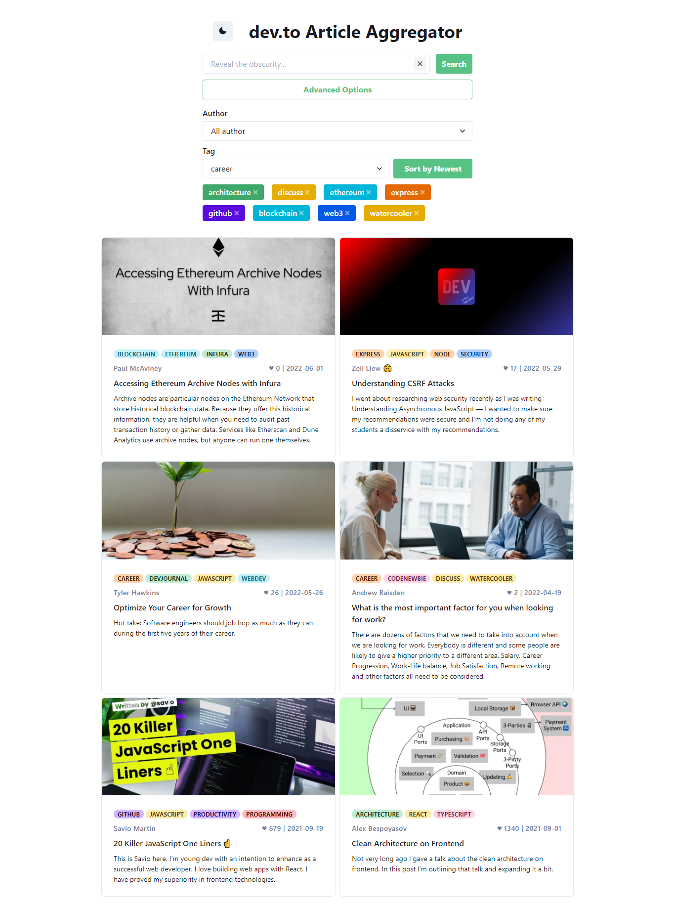

<div id="top"></div>

<!-- PROJECT SHIELDS -->
[![MIT License][license-shield]][license-url]

<!-- PROJECT LOGO -->
<br />
<div align="center">
  <a href="https://github.com/dickyhermawan12/devto-semantic-article-aggregator">
    
  </a>

<h3 align="center">dev.to Semantic Article Aggregator</h3>

  <p align="center">
    This serves as an example of semantic web implementation for aggregating dev.to articles.
    <br />
    <a href="https://github.com/dickyhermawan12/devto-semantic-article-aggregator/issues">Report Bug</a>
    ·
    <a href="https://github.com/dickyhermawan12/devto-semantic-article-aggregator/issues">Request Feature</a>
  </p>
</div>


<!-- TABLE OF CONTENTS -->
<details>
  <summary>Table of Contents</summary>
  <ol>
    <li>
      <a href="#about-the-project">About The Project</a>
      <ul>
        <li><a href="#built-with">Built With</a></li>
      </ul>
    </li>
    <li>
      <a href="#getting-started">Getting Started</a>
      <ul>
        <li><a href="#prerequisites">Prerequisites</a></li>
        <li><a href="#installation">Installation</a></li>
      </ul>
    </li>
    <li><a href="#contributing">Contributing</a></li>
    <li><a href="#license">License</a></li>
    <li><a href="#contact">Contact</a></li>
    <li><a href="#acknowledgments">Acknowledgments</a></li>
  </ol>
</details>


<!-- ABOUT THE PROJECT -->
## About The Project



This repository is a final project repo for Semantic Web Class, Teknik Informatika, Universitas Padjadjaran.

<p align="right">(<a href="#top">back to top</a>)</p>


### Built With

* [NuxtJS](https://nuxtjs.org/)
* [Vue Chakra UI](https://vue.chakra-ui.com/)

<p align="right">(<a href="#top">back to top</a>)</p>


<!-- GETTING STARTED -->
## Getting Started

### Prerequisites

In order to have this project installed and running, you need to install the following:
- Git
- Node.js
- npm

### Installation

1. Clone the repo
   ```sh
   git clone https://github.com/dickyhermawan12/devto-semantic-article-aggregator.git
   ```
2. Install NPM packages
   ```sh
   npm install
   ```
3. Run the server
   ```sh
   npm run dev
   ```

<p align="right">(<a href="#top">back to top</a>)</p>


<!-- CONTRIBUTING -->
## Contributing

Contributions are what make the open source community such an amazing place to learn, inspire, and create. Any contributions you make are **greatly appreciated**.

If you have a suggestion that would make this better, please fork the repo and create a pull request. You can also simply open an issue with the tag "enhancement".
Don't forget to give the project a star! Thanks again!

1. Fork the Project
2. Create your Feature Branch (`git checkout -b feature/AmazingFeature`)
3. Commit your Changes (`git commit -m 'Add some AmazingFeature'`)
4. Push to the Branch (`git push origin feature/AmazingFeature`)
5. Open a Pull Request

<p align="right">(<a href="#top">back to top</a>)</p>


<!-- LICENSE -->
## License

Distributed under the MIT License. See `LICENSE.txt` for more information.

<p align="right">(<a href="#top">back to top</a>)</p>


<!-- CONTACT -->
## Contact

Dicky Rahma Hermawan - dickyrahmahermawan@gmail.com

Project Link: [https://github.com/dickyhermawan12/devto-semantic-article-aggregator](https://github.com/dickyhermawan12/devto-semantic-article-aggregator)

<p align="right">(<a href="#top">back to top</a>)</p>


<!-- ACKNOWLEDGMENTS -->
## Acknowledgments

* [sparql-http-client](https://github.com/zazuko/sparql-http-client)
* [Best-README-Template](https://github.com/othneildrew/Best-README-Template)

<p align="right">(<a href="#top">back to top</a>)</p>


<!-- MARKDOWN LINKS & IMAGES -->
[license-shield]: https://img.shields.io/github/license/dickyhermawan12/devto-semantic-article-aggregator.svg?style=for-the-badge
[license-url]: https://github.com/dickyhermawan12/devto-semantic-article-aggregator/blob/main/LICENSE.txt
